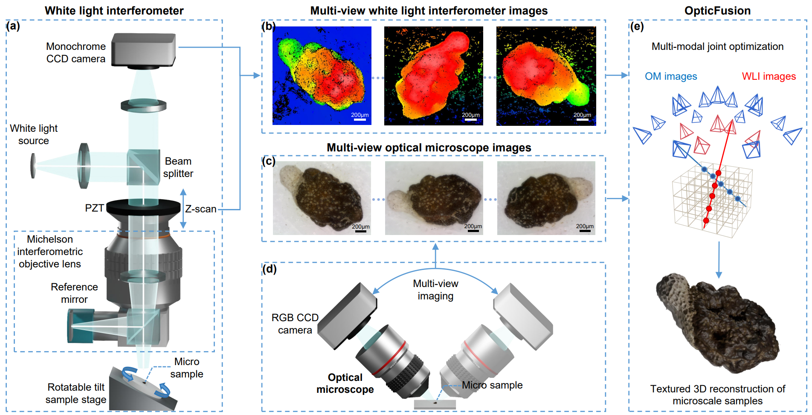

# OpticFusion: Multi-Modal Neural Implicit 3D Reconstruction of Microstructures by Fusing White Light Interferometry and Optical Microscopy
## International Conference on 3D Vision (3DV) 2025 Oral

## [Paper](https://arxiv.org/abs/2501.09259) | [WLI-OM Dataset](https://www.dropbox.com/scl/fi/my7foxtxanpa2fi8dzvh1/WLI-OM.rar?rlkey=u0qyf1pl53l2vdqsp589d3xd2&st=qufau3kf&dl=0)
**In this repository, we provide a framework that achieves textured 3D reconstruction of microstructures by combining the data of White Light Interferometry (WLI) and Optical Microscopy (OM). WLI is a precise optical tool for measuring the 3D topography of microstructures. However, conventional WLI cannot capture the natural color of a sample's surface, which is essential for many microscale research applications that require both 3D geometry and color information. In this work, we address this challenge from a computer vision multi-modal reconstruction perspective for the first time.**

<p align="center">

</p>

<p align="center">
 
</p>

---
## Multi-Modal WLI-OM Microstructures Dataset
We constructed the first dataset comprising multi-view OM images and WLI scans of real-world microscale samples. This dataset includes five sequences collected from typical microstructures studied in microscale research, such as flower seeds, a butterfly wing, a circuit
board, and an electronic component. The surface geometric features of these samples range in size from tens to hundreds of micrometers. Each sample contains 37 multi-view OM images collected by [Dino-Lite AM7915MZT](https://www.dino-lite.com/products_detail.php?index_id=130) and 5 multi-view WLI scans obtained by [Zygo Newview 8200](https://www.zygo.com/).
Download our [WLI-OM Dataset](https://www.dropbox.com/scl/fi/my7foxtxanpa2fi8dzvh1/WLI-OM.rar?rlkey=u0qyf1pl53l2vdqsp589d3xd2&st=qufau3kf&dl=0) and put it under **load/**. 


## Installation
Please setup conda environment with PyTorch>=1.10.
```
git clone https://github.com/zju3dv/OpticFusion.git
cd OpticFusion
pip install git+https://github.com/NVlabs/tiny-cuda-nn/#subdirectory=bindings/torch
pip install -r requirements.txt
```

## Usage
Replace **${SCENE_NAME}** with the folder's name in the WLI-OM dataset and run the following command. The reconstruction results are saved to the **exp/** folder.

```
python launch.py --config configs/wli-om.yaml --gpu 0 --train dataset.scene=${SCENE_NAME} tag=recon 
```

## Citation
If you find our paper, code or dataset useful in your own research, please cite us:
```
@misc{chen2025opticfusionmultimodalneuralimplicit,
      title={OpticFusion: Multi-Modal Neural Implicit 3D Reconstruction of Microstructures by Fusing White Light Interferometry and Optical Microscopy}, 
      author={Shuo Chen and Yijin Li and Guofeng Zhang},
      year={2025},
      eprint={2501.09259},
      archivePrefix={arXiv},
      primaryClass={cs.CV},
      url={https://arxiv.org/abs/2501.09259}, 
}
```

## Acknowledgements
Thanks [instant-nsr-pl](https://github.com/bennyguo/instant-nsr-pl) for their outstanding implementation of neural implicit surface reconstruction.
